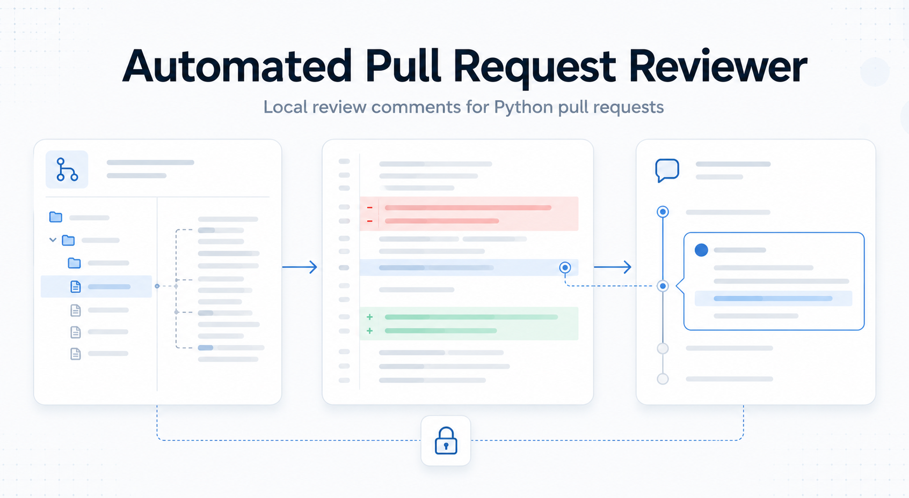

<h1 align="center">Automated Pull Request Reviewer</h1>

<p align="center">
  
</p>

<p align="center">
| <a href="TODO_FINAL_REPORT_PDF_URL"><b>Final CRISP-DM Report</b></a> | <a href="TODO_PRESENTATION_SLIDES_URL"><b>Presentation Slides</b></a> | <a href="https://drive.google.com/file/d/1j87JaL00Pqbw8Ta7AHvyHwHbg9NWEOVi/view?usp=sharing"><b>Video Presentation</b></a> |
</p>


Automated Pull Request Reviewer (APR) is a local code-review pipeline for Python pull requests. It reconstructs changed files, adds repository context, asks a local language model to find blocking issues, and returns review comments with line ranges.

The project is built around one constraint: proprietary code should not be sent to external model APIs during inference. The demo and model pipeline run locally; external APIs are used only for data collection and optional dataset labeling workflows.

## Navigation

- [How it works](#how-it-works)
- [Repository map](#repository-map)
- [Key files](#key-files)
- [Notebooks](#notebooks)
- [Documents and reports](#documents-and-reports)
- [Run the demo](#run-the-demo)
- [Common commands](#common-commands)
- [Scope](#scope)

## How it works

APR reviews one changed Python file at a time.

1. Pull request data is collected from GH Archive and GitHub APIs.
2. File patches are applied to reconstruct the reviewer-visible file state.
3. Local imports, usage sites, metadata files, and the repository tree are collected as context.
4. The context is compressed into a prompt with numbered changed-file lines.
5. The reviewer model generates a JSON review result:

```json
{
  "issues": [
    {
      "line_range": {"start": 42, "end": 45},
      "comment": "This path can raise before the transaction is rolled back."
    }
  ]
}
```

An empty `issues` list means no blocking issue was detected.

## Repository map

```text
.
├── demo/                         Streamlit demo for reviewing a live GitHub PR
├── docs/
│   ├── design/                   Architecture, model choice, system design
│   └── reports/                  Final report and evaluation methodology
├── notebooks/                    Data collection, EDA, judging, training, evaluation
├── src/
│   ├── ai_code_reviewer/
│   │   ├── dataset/              GH Archive/GitHub collection and enrichment
│   │   ├── data_processing/      Cleaning, compression, LLM-as-judge labeling
│   │   ├── models/               Prompting, retrieval, inference, schemas
│   │   └── finetuning/           Supervised fine-tuning for chat models
│   └── evaluation/               Offline metrics: detection, IoU, BERTScore
├── pyproject.toml                Package metadata and dependency groups
├── requirements.txt              Pinned environment used in experiments
└── README.md
```

## Key files

| Area | File | What to look for |
|---|---|---|
| Demo entrypoint | [`demo/app.py`](demo/app.py) | Streamlit UI, eager model loading, PR URL flow |
| Demo adapter | [`demo/adapters.py`](demo/adapters.py) | Live GitHub fetch, sample construction, inference backend dispatch |
| Prompt pipeline | [`src/ai_code_reviewer/models/pipeline.py`](src/ai_code_reviewer/models/pipeline.py) | Converts dataset rows into review prompts |
| Prompt template | [`src/ai_code_reviewer/models/prompts.py`](src/ai_code_reviewer/models/prompts.py) | Reviewer instruction and required JSON schema |
| Model inference | [`src/ai_code_reviewer/models/inference.py`](src/ai_code_reviewer/models/inference.py) | Transformers wrapper and output parsing |
| Data schema | [`src/ai_code_reviewer/models/schema.py`](src/ai_code_reviewer/models/schema.py) | `ReviewSample`, `PredictedIssue`, `ReviewPrediction` |
| Patch handling | [`src/ai_code_reviewer/dataset/patches.py`](src/ai_code_reviewer/dataset/patches.py) | Applies unified diffs and maps line ranges |
| Dataset enrichment | [`src/ai_code_reviewer/dataset/github_api.py`](src/ai_code_reviewer/dataset/github_api.py) | GitHub API enrichment, dependency extraction, file trees |
| Import resolution | [`src/ai_code_reviewer/dataset/import_resolution.py`](src/ai_code_reviewer/dataset/import_resolution.py) | Resolves in-repo Python imports |
| Data cleaning | [`src/ai_code_reviewer/data_processing/data_cleaning.py`](src/ai_code_reviewer/data_processing/data_cleaning.py) | Context compression and LLM-as-judge prompt building |
| Fine-tuning | [`src/ai_code_reviewer/finetuning/train.py`](src/ai_code_reviewer/finetuning/train.py) | HuggingFace Trainer setup for SFT |
| Evaluation | [`src/evaluation/metrics.py`](src/evaluation/metrics.py) | Precision/recall/F1, line IoU, BERTScore |

## Notebooks

The notebooks mirror the main research workflow. They are useful when the goal
is to inspect intermediate data, reproduce plots, or walk through the project
phase by phase without reading the full package code first.

| Notebook | Purpose |
|---|---|
| [`notebooks/01_data_collection.ipynb`](notebooks/01_data_collection.ipynb) | Collect review-comment data and enrich pull requests with GitHub metadata. |
| [`notebooks/02_data_understanding.ipynb`](notebooks/02_data_understanding.ipynb) | Explore comment distributions, context lengths, dependency coverage, and data quality. |
| [`notebooks/03_llm_judging.ipynb`](notebooks/03_llm_judging.ipynb) | Build and inspect LLM-as-judge prompts for comment classification and negative validation. |
| [`notebooks/04_data_preparation.ipynb`](notebooks/04_data_preparation.ipynb) | Construct model-ready rows, labels, prompts, targets, and train/validation/test splits. |
| [`notebooks/05_baseline_evaluation.ipynb`](notebooks/05_baseline_evaluation.ipynb) | Run baseline inference and inspect detection, localization, and comment-quality metrics. |
| [`notebooks/06_finetuning_and_evaluation.ipynb`](notebooks/06_finetuning_and_evaluation.ipynb) | Fine-tune the reviewer model and compare it against the baseline. |

## Documents and reports

| Document | Purpose |
|---|---|
| [`docs/reports/report.tex`](docs/reports/report.tex) | Main CRISP-DM report: business case, data, modeling, evaluation, deployment |
| [`docs/design/design_doc.md`](docs/design/design_doc.md) | End-to-end ML system design and evaluation strategy |
| [`docs/design/architecture.md`](docs/design/architecture.md) | Solution architecture, data flow, assumptions, limitations |
| [`docs/design/baseline_model.md`](docs/design/baseline_model.md) | Baseline model comparison and Qwen3-1.7B selection rationale |
| [`docs/reports/comment_quality_evaluation.md`](docs/reports/comment_quality_evaluation.md) | Comment-quality evaluation: ROUGE-L, BERTScore, CodeBERT, LLM-as-judge |
| [`demo/README.md`](demo/README.md) | Demo setup, backend options, environment variables, troubleshooting |

## Run the demo

The demo accepts a GitHub pull request URL, builds the review context, runs local inference, and renders review-style comments.

Install the package with demo and inference dependencies:

```bash
pip install -e ".[finetune,demo]"
```

For public PRs this can run without a token, but GitHub will rate-limit requests. Private repositories require `GITHUB_TOKEN`.

```bash
export GITHUB_TOKEN=ghp_your_token_here
streamlit run demo/app.py
```

To run a local HuggingFace/Transformers model directly from the demo process:

```bash
APR_BACKEND=transformers \
APR_MODEL_NAME=Qwen/Qwen3-1.7B \
APR_DEVICE=auto \
APR_TORCH_DTYPE=bfloat16 \
APR_MAX_INPUT_TOKENS=16384 \
streamlit run demo/app.py
```

`APR_MODEL_NAME` can also point to a local checkpoint directory, for example a
fine-tuned model under `outputs/`.

If the model is served separately, point APR to any OpenAI-compatible chat API.
For example, a local vLLM server exposing `/v1/chat/completions` can be used as
the inference backend:

```bash
APR_BACKEND=openai \
APR_OPENAI_BASE_URL=http://localhost:8000/v1 \
APR_OPENAI_MODEL=your-model-name \
streamlit run demo/app.py
```

More details are in [`demo/README.md`](demo/README.md).

## Common commands

Build prompts from JSONL rows:

```bash
python -m ai_code_reviewer.models.pipeline \
  --jsonl data/test.jsonl \
  --max-samples 10
```

Run baseline inference and save predictions:

```bash
python -m ai_code_reviewer.models.pipeline \
  --jsonl data/test.jsonl \
  --infer \
  --output-csv runs/test_predictions.csv
```

Evaluate saved predictions:

```bash
python -m evaluation.metrics \
  --csv_path runs/test_predictions.csv \
  --output-json runs/test_metrics.json
```

Fine-tune the reviewer model:

```bash
python -m ai_code_reviewer.finetuning.train \
  --train_file data/train.jsonl \
  --validation_file data/validation.jsonl \
  --output_dir outputs/qwen3-review-sft
```

## Scope

APR currently targets:

- Python `.py` files.
- Blocking issues: correctness, reliability, security, data-loss risk, severe maintainability problems.
- Inline review comments with line ranges.
- Local inference for privacy-sensitive code.

APR does not target:

- Formatting, naming, import order, or style-only feedback.
- Jupyter notebooks.
- Non-Python pull requests.
- Automatic merge blocking in the MVP.
